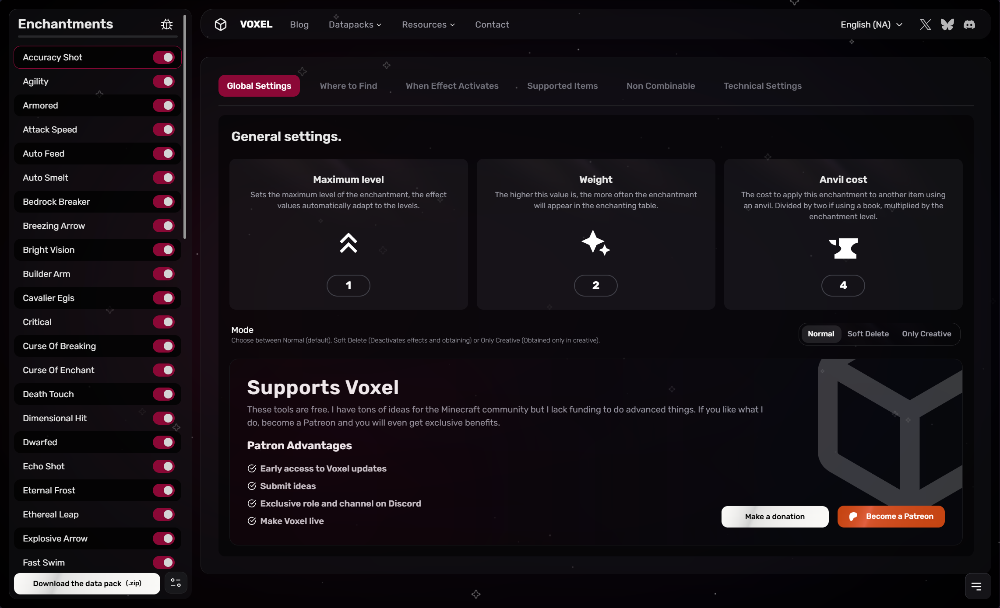

# Disable/Balance enchantment

## <mark style="color:orange;">How to balance enchantments</mark>

There is two ways to balances enchantments from NeoEnchant datapack/mods.

### 1. Editing the enchantments with Voxel

Voxel is a platform available at this address [https://voxel.hardel.io/en-us/tools/enchant](https://voxel.hardel.io/en-us/tools/enchant) which allows you to modify enchantments with a very user-friendly interface, designed for the general public.





Download the packs you want to modify

To begin modifying your packs, you need to visit platforms such as Modrinth or Curseforge, or any other site that hosts the packs or mods you wish to alter. This tool is versatile and allows you to edit content from any creator, including NeoEnchant or others, providing a tailored experience to suit your specific customization needs.



Import your content on Voxel

Visit Voxel using the link above, and you can import packs in either the (zip) Datapack format or the (jar) Mods format. Both formats are compatible, and from there you will be greeted by a user-friendly interface designed to make your customization process smooth and intuitive.



Select the enchantment you wish to modify

On the Voxel interface, select the enchantment you wish to modify from the left-hand list. You can also click on the pink button next to it to deactivate the enchantment, allowing you to edit or remove it effortlessly.

<figure><figcaption></figcaption></figure>


Note that a deactivated enchantment will still be in play in the creative menu or via commands.\
The enchantment just becomes impossible to obtain, and these effects are removed.




Upload the updated content

Once your edits are done, find the download button at the bottom left of the Voxel site. Click it to download your updated content and enjoy your game!




he name of the zip or rare file has no technical influence in Minecraft, so you can rename it if you like.


### 2. Editing the packs with Editor

Both datapacks and mods contain the same things, but datapacks are particularly easy to modify without programming skills, as they consist of simple configuration files. This allows packs to be customized by modifying these files.&#x20;

See the Technical or Enchantment page for information on which files control what.
