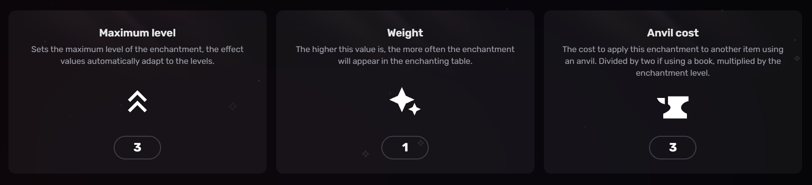
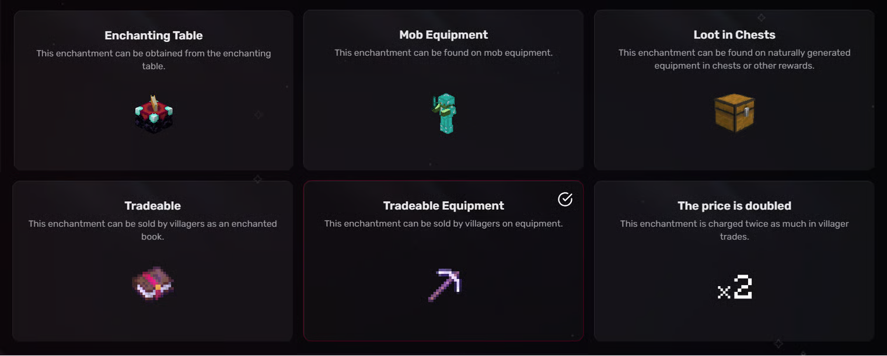
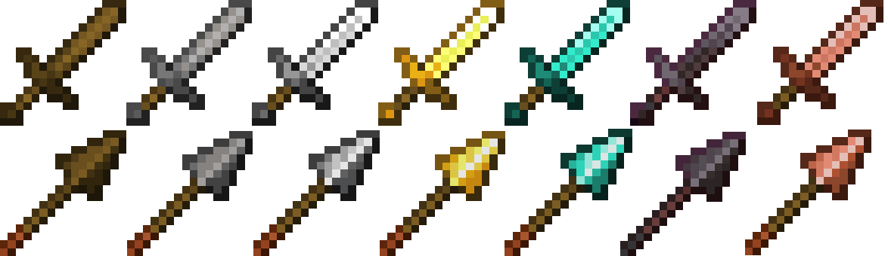

# Curse of Clumsiness (1.21.6)

### <mark style="color:orange;">Effects</mark>

* Reduce damage by -2 at level one and -1 per level (-4 at level III)
* Curse Enchantment

<figure><figcaption></figcaption></figure>

***

### <mark style="color:orange;">Availability</mark>

This section tells you how the enchantment is obtained, as well as other more specific information.

Legend: Explanations of each box.

***

_**Enchanting table:**_ If the enchantment is obtainable from the enchantment table

_**Mob Equipement:**_ Monsters such as zombies or skeleton can appear naturally with this enchantment on their equipment.

_**Loot in Chest:**_ These enchantments can be found on naturally generated equipment from loot tables.

_**Tradeable:**_ These enchantments can be sold by villagers.

_**Tradeable Equipement:**_ These enchantments can be found on equipment sold by villagers.

_**The Price is Doubled:**_ These enchantments get charged twice as much in villager trades.

<figure><figcaption>
Darker boxes represent true, lighter boxes false
</figcaption></figure>

***

### <mark style="color:orange;">Compatible Items</mark>

Explanation Primary / Supported (Technical)

**Primary Items (Enchanting Table):**  Items for which this enchantment appears in an [enchanting table](https://minecraft.wiki/w/Enchanting_table).

**Supported Items (Anvil):**  Items on which this enchantment can be applied using an anvil or using the [`/enchant`](https://minecraft.wiki/w/Commands/enchant) command.


If Primary Items is not specified, then it is set to Supported Items.


<figure><figcaption>
Sword - Enchanting Table and Anvil
</figcaption></figure>

<figure><figcaption>
Sword - Enchanting Table and Anvil
</figcaption></figure>

***

### <mark style="color:orange;">NeoEnchant - Addons- Vanilla Structure :</mark>

The list of places where this enchantment can be found in the vanilla structure, with this addons:

* Can be found in **"Ruined Portal"**
* Can be found in **"Villager Outpost"**
* Can be found in **"Ancient city"**

<mark style="color:$info;">This add-on is installed separately; the enchantments are not found by default in the vanilla structure.<mark style="color:$info;">

***

