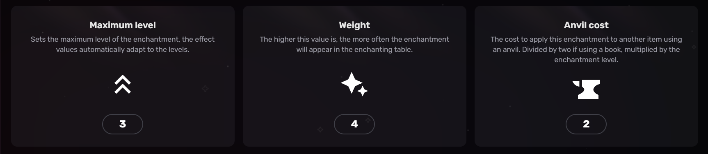
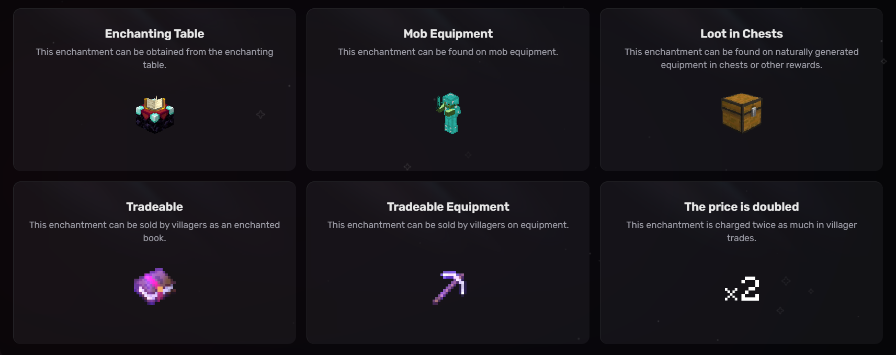

# Tears of Asflors


This enchantment is linked to Yggdrasil content. To use or find it, you need to install Yggdrasil.


### <mark style="color:orange;">Effects</mark>

* Increases attack damage by 3 at level I, +1 per level (+5 at level III)
* Consumes player XP with each hit
* Only works when player has at least 5 levels

> Converts player experience into attack damage.

<figure><figcaption></figcaption></figure>

***

### <mark style="color:orange;">Availability</mark>

This section tells you how the enchantment is obtained, as well as other more specific information.

Legend: Explanations of each box.

***

_**Enchanting table:**_ If the enchantment is obtainable from the enchantment table

_**Mob Equipement:**_ Monsters such as zombies or skeleton can appear naturally with this enchantment on their equipment.

_**Loot in Chest:**_ These enchantments can be found on naturally generated equipment from loot tables.

_**Tradeable:**_ These enchantments can be sold by villagers.

_**Tradeable Equipement:**_ These enchantments can be found on equipment sold by villagers.

_**The Price is Doubled:**_ These enchantments get charged twice as much in villager trades.

<figure><figcaption>
Darker boxes represent true, lighter boxes false
</figcaption></figure>

***

### <mark style="color:orange;">Compatible Items</mark>

Explanation Primary / Supported (Technical)

**Primary Items (Enchanting Table):**  Items for which this enchantment appears in an [enchanting table](https://minecraft.wiki/w/Enchanting_table).

**Supported Items (Anvil):**  Items on which this enchantment can be applied using an anvil or using the [`/enchant`](https://minecraft.wiki/w/Commands/enchant) command.


If Primary Items is not specified, then it is set to Supported Items.


<figure><figcaption>
Sword - Enchanting Table and Anvil
</figcaption></figure>

***

### <mark style="color:orange;">Incompatibilities</mark>

This enchantment cannot be combined with the other enchantments on this list:


[pull.md](pull.md)



[life-steal.md](life-steal.md)



[fear.md](fear.md)



[last-hope.md](last-hope.md)



[critical.md](critical.md)



[death-touch.md](death-touch.md)


***

### <mark style="color:orange;">NeoEnchant - Addons- Vanilla Structure :</mark>

The list of places where this enchantment can be found in the vanilla structure, with this addons:

* Can be found in **"Mansion chest"**

<mark style="color:$info;">This add-on is installed separately; the enchantments are not found by default in the vanilla structure.<mark style="color:$info;">

***

### <mark style="color:orange;">Yggdrasil</mark>

The list of places where this enchantment can be found in the structures of Yggdrasil.

<table><thead><tr><th align="center">Structure</th><th data-type="checkbox">Vault</th><th data-type="checkbox">Ominous Vault</th><th data-type="checkbox">Spawner</th><th data-type="checkbox">Ominous Spawner</th><th data-type="checkbox">Chest</th></tr></thead><tbody><tr><td align="center">Asflors</td><td>true</td><td>true</td><td>false</td><td>false</td><td>false</td></tr></tbody></table>
