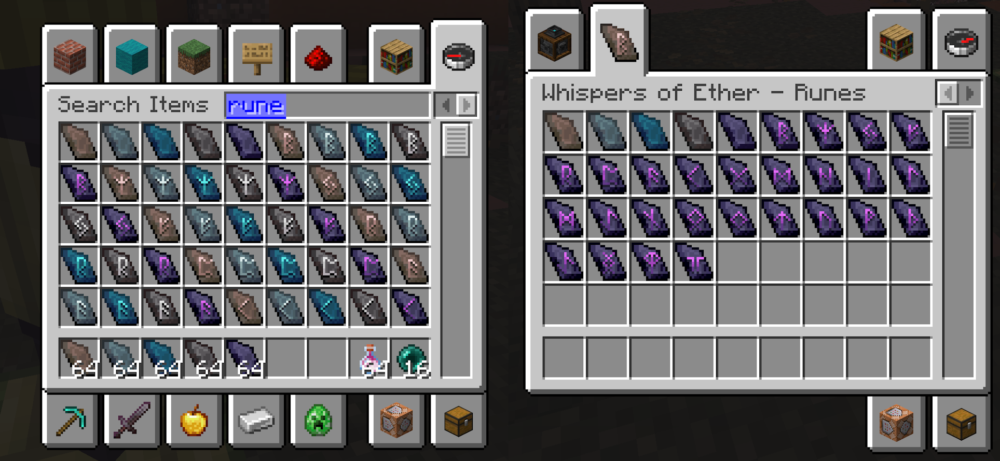

# Runes

### <mark style="color:orange;">Creatives Tabs:</mark>

A dedicated **Creative Tab** is available to easily access all runic content:

* All **5 tiers of blank runes** (Rune, Reinforced, Echo, Nether, Dragon)
* All **Dragon Runes** (tier 5) for each attribute

<figure><figcaption></figcaption></figure>

### <mark style="color:orange;">Vanilla Runes Statistics</mark>

Each rune is associated with a Minecraft Vanilla statistic. Here are all the statistics that have associated runes.

| Rune                              | Effect                             |
| --------------------------------- | ---------------------------------- |
| Rune of Armor                     | Increases armor points             |
| Rune of Armor Toughness           | Increases armor toughness          |
| Rune of Attack Damage             | Increases attack damage            |
| Rune of Attack Knockback          | Increases knockback dealt          |
| Rune of Attack Speed              | Increases attack speed             |
| Rune of Block Break Speed         | Increases block breaking speed     |
| Rune of Block Interaction Range   | Increases block interaction range  |
| Rune of Burning Time              | Modifies burning duration          |
| Rune of Entity Interaction Range  | Increases entity interaction range |
| Rune of Fall Damage Multiplier    | Reduces fall damage                |
| Rune of Jump Strength             | Increases jump height              |
| Rune of Knockback Resistance      | Increases knockback resistance     |
| Rune of Max Health                | Increases maximum health           |
| Rune of Mining Efficiency         | Increases mining speed             |
| Rune of Movement Speed            | Increases movement speed           |
| Rune of Pickup Area Size          | Increases item pickup radius       |
| Rune of Safe Fall Distance        | Increases safe fall distance       |
| Rune of Sneaking Speed            | Increases sneaking speed           |
| Rune of Step Height               | Increases step height              |
| Rune of Sweeping Damage Ratio     | Increases sweeping damage          |
| Rune of Water Movement Efficiency | Increases underwater movement      |

### <mark style="color:orange;">WOE Runes Statistics</mark>

Additional statistics have been added to WOE. Please refer to the dedicated page.

| Rune                       | Effect                                           |
| -------------------------- | ------------------------------------------------ |
| Rune of Critical Rate      | Increases critical hit chance                    |
| Rune of Critical Damage    | Increases critical hit damage multiplier         |
| Rune of Omnivampirism      | Heals over time when dealing damage              |
| Rune of Omnivampirism Rate | Increases the healing rate                       |
| Rune of Multi Jump         | Allows additional jumps mid-air (up to 5 jumps!) |

***

## <mark style="color:orange;">Complete Rune Statistics Table</mark>

Below is the complete list of all available runes with their detailed properties:

| Rune Name                 | Weight | Max Value | On Pass (Min - Max) |
| ------------------------- | ------ | --------- | ------------------- |
| Armor                     | 10.0   | 12.0      | 0.1 to 0.9          |
| Armor Toughness           | 15.0   | 1.0       | 0.01 to 0.07        |
| Attack Damage             | 20.0   | 12.0      | 0.1 to 0.85         |
| Attack Knockback          | 10.0   | 2.0       | 0.03 to 0.15        |
| Attack Speed              | 12.0   | 1.0       | 0.01 to 0.07        |
| Block Break Speed         | 50.0   | 3.0       | 0.15 to 0.75        |
| Block Interaction Range   | 15.0   | 3.0       | 0.1 to 0.5          |
| Burning Time              | 25.0   | -0.25     | -0.01 to -0.07      |
| Entity Interaction Range  | 50.0   | 2.0       | 0.1 to 0.5          |
| Fall Damage Multiplier    | 25.0   | -1.0      | -0.01 to -0.1       |
| Jump Strength             | 10.0   | 2.0       | 0.05 to 0.15        |
| Knockback Resistance      | 20.0   | 1.0       | 0.01 to 0.1         |
| Max Health                | 20.0   | 10.0      | 0.5 to 1.0          |
| Mining Efficiency         | 1.0    | 1.0       | 0.01 to 0.1         |
| Movement Speed            | 15.0   | 1.0       | 0.01 to 0.1         |
| Pickup Area Size          | 30.0   | 5.0       | 0.5 to 1.0          |
| Safe Fall Distance        | 25.0   | 10.0      | 0.25 to 2.0         |
| Sneaking Speed            | 5.0    | 1.5       | 0.07 to 1.12        |
| Step Height               | 75.0   | 2.0       | 0.5 to 1.0          |
| Sweeping Damage Ratio     | 5.0    | 1.0       | 0.01 to 0.1         |
| Water Movement Efficiency | 25.0   | 1.0       | 0.01 to 0.1         |
| Critical Rate             | 25.0   | 0.25      | 0.01 to 0.07        |
| Critical Damage           | 20.0   | 1.0       | 0.01 to 0.1         |
| Multi Jump                | 50.0   | 3.0       | 1.0 to 1.0          |
| Omnivampirism             | 20.0   | 0.5       | 0.01 to 0.05        |
| Omnivampirism Rate        | 15.0   | 1.0       | 0.01 to 0.1         |

#### Table Legend

* **Weight**: Number of runic points removed upon success
* **Max Value**: Maximum value of the statistic on an item
* **On Pass (Min - Max)**: How much it increments
