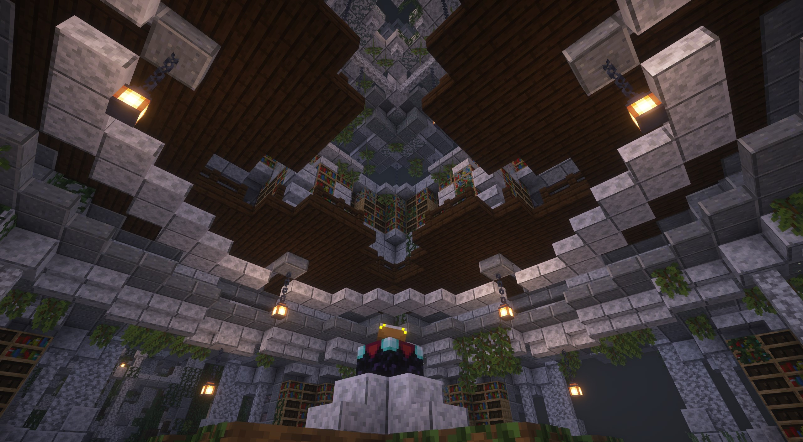
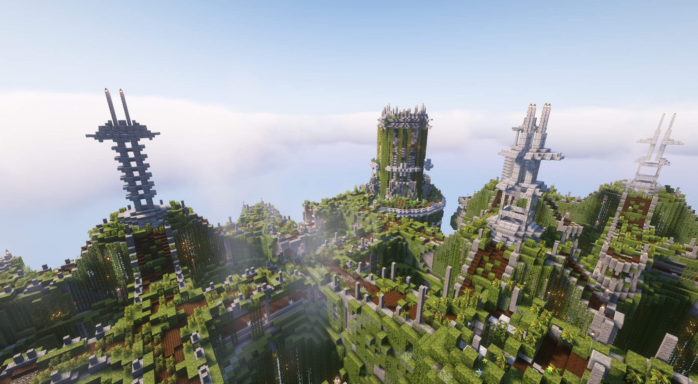
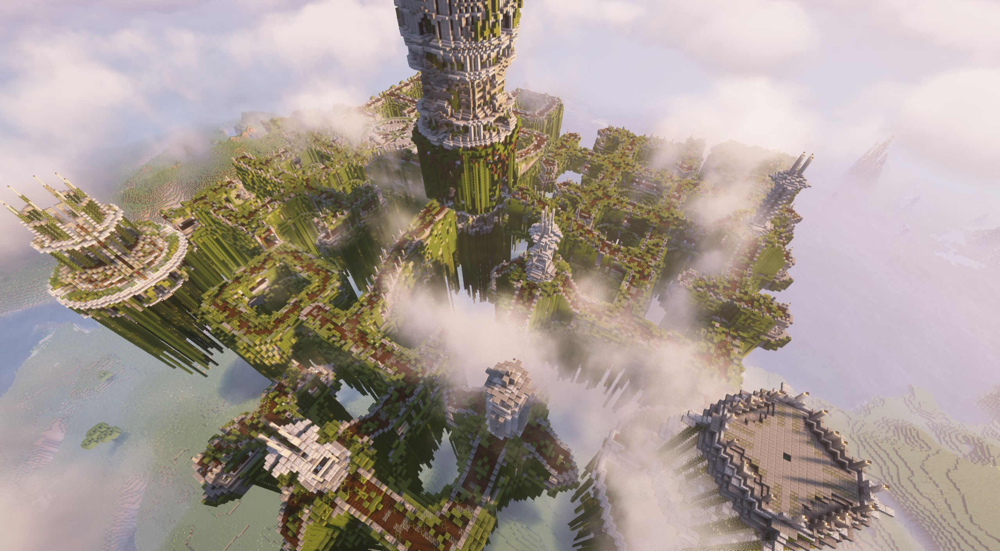
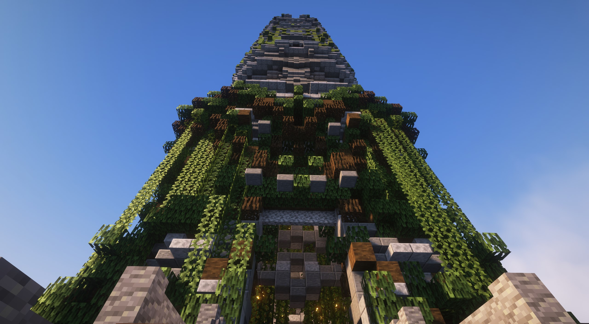
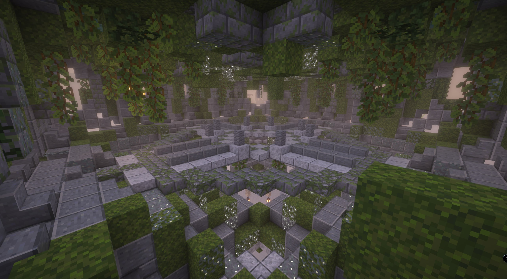
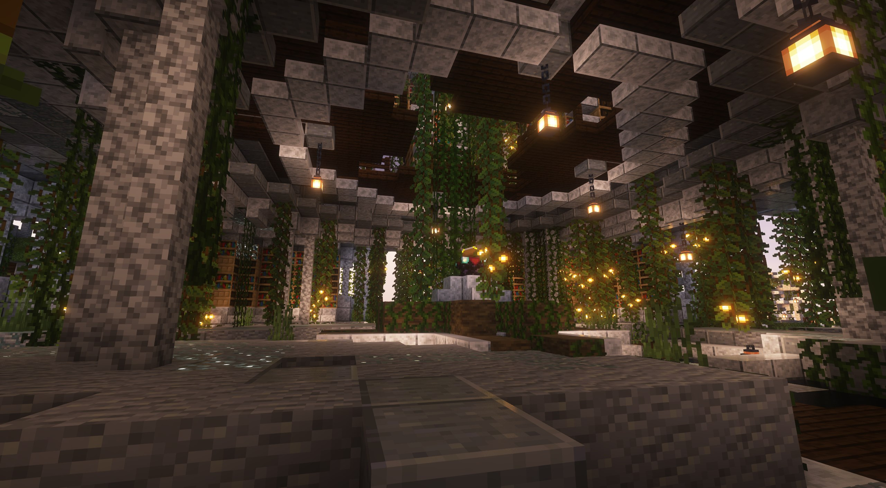
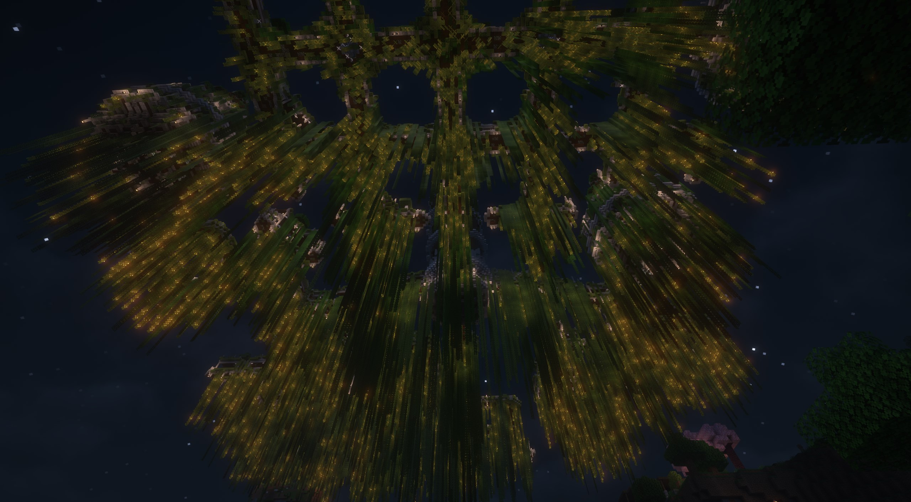
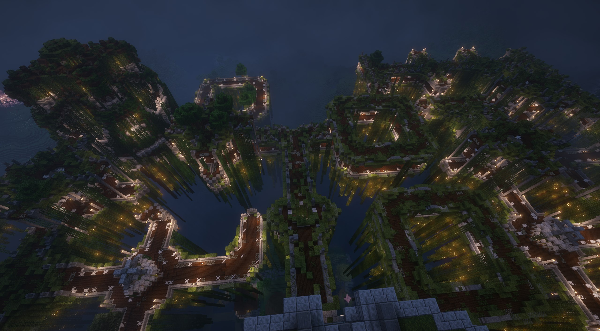
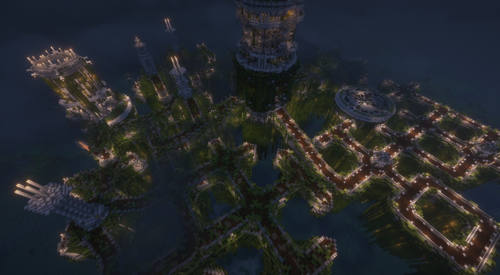

# Asgards

## <mark style="color:orange;">Gallery</mark>

<div><figure><figcaption></figcaption></figure> <figure><figcaption></figcaption></figure> <figure><figcaption></figcaption></figure></div>

<div><figure><figcaption></figcaption></figure> <figure><figcaption></figcaption></figure> <figure><figcaption></figcaption></figure></div>

<div><figure><figcaption></figcaption></figure> <figure><figcaption></figcaption></figure> <figure><figcaption></figcaption></figure></div>

## <mark style="color:orange;">Information</mark>

Asgard is a magnificent structure that appears randomly in the world. While finding it by chance is possible, the easiest way to locate it is by finding its associated stele, the Neogard. This mini-structure provides a map leading directly to Asgard.

### Narrative Hub & Lore:

Asgard stands as the central pillar of Yggdrasil's overarching story. Prepare to delve deep into its lore, enriched by 16 new books that radically expand the narrative. At its heart, discover a unique suspended village, a hub of activity within this divine realm.

### Challenges & Rewards:

Asgard presents the highest level of difficulty found within this pack, so ensure you are thoroughly prepared before venturing forth. The challenges, however, yield significant rewards:

* Legendary Weapon - Gungnir: Embark on a perilous journey into Asgard's ominous vaults to claim the mythical spear, Gungnir.
* Midas' Touch: Uncover this unique artifact, granting the wielder the power to transmute blocks into solid gold.
* The Infinite Tower: Test your limits by attempting to ascend the endless tower located at Asgard's center.

### Exploration:

Beyond the main challenges, Asgard offers much to explore:

* Mysterious Underground Routes: Don't just stick to the surface! Explore the hidden, beautifully crafted subterranean passages beneath Asgard's roads.
* Exclusive Key Exchanges: Seek out specific villagers within Asgard who offer the valuable service of trading your collected Asgard keys for divine keys.

## <mark style="color:orange;">Command</mark>

```css
locate structure yggdrasil:asgard
```
