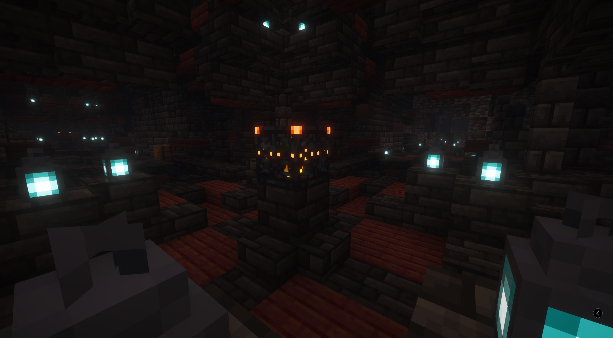
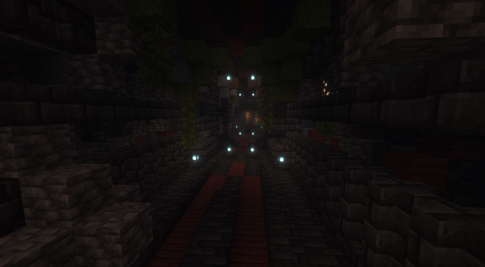
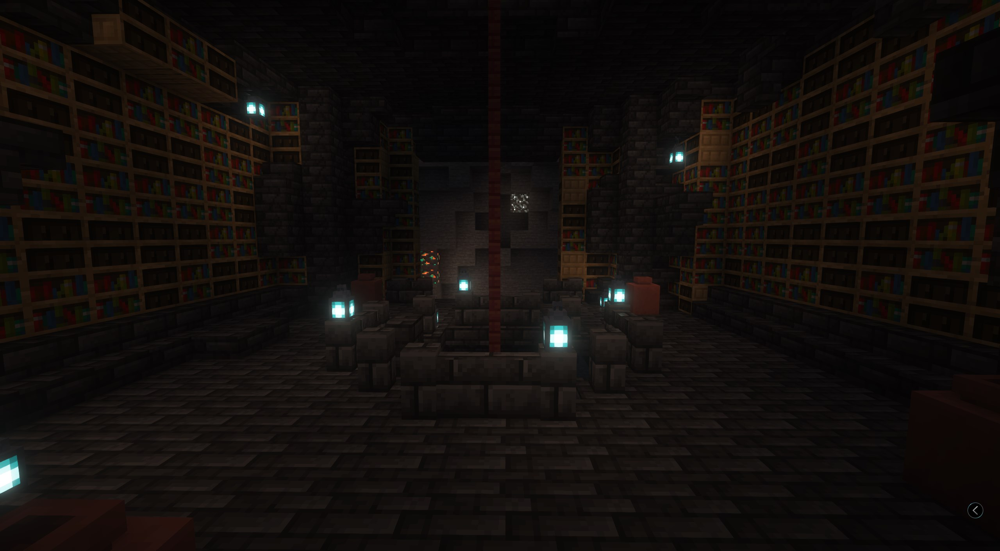
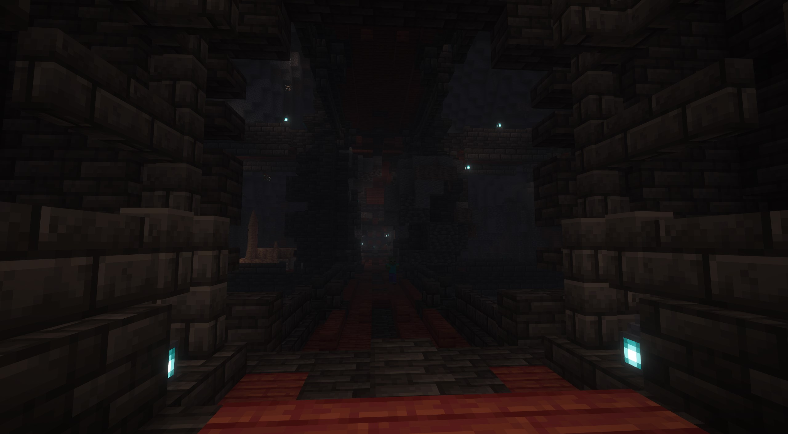

# Helheim

## <mark style="color:orange;">Gallery</mark>

<div><figure><figcaption></figcaption></figure> <figure><figcaption></figcaption></figure></div>

<div><figure><figcaption></figcaption></figure> <figure><figcaption></figcaption></figure></div>

### Information

Helheim emerges randomly deep beneath the earth. The easiest way to find it is by obtaining a map from its associated stele, the Helblom.


This structure is generated in underground, and adapts to biomes like Lush Cave.



Challenges and Rewards:

Prepare for an extreme challenge; Helheim is one of the most difficult locations in this world. Success yields unique rewards, including:

* An exclusive enchantment capable of inflicting the Darkness effect on foes.
* A unique pet companion, acquired upon completing the structure's specific questline. This pet grants a beneficial effect to its owner.

#### Narrative Significance:

Helheim is a crucial location in the Yggdrasil saga, particularly for understanding the story from Hel's perspective and exploring themes of tragedy.

***

### Obtaining the Helheim Pet (Reva):

To acquire the unique pet companion from Helheim, you must follow its specific quest. This involves:



### Quest Books

Thoroughly exploring Helheim and locating all the lore books detailing its tragic history.



### Locate the room

Ascending to the structure's final floor, it's the highest room in a tower.



### Place books

Placing each of the read lore books onto the designated lecterns found ther.

Completing this task will reveal a hidden chest. Inside, you'll find information leading you to the location of Reva, the Helheim pet.



## <mark style="color:orange;">Command</mark>

```css
locate structure yggdrasil:helhei
```
