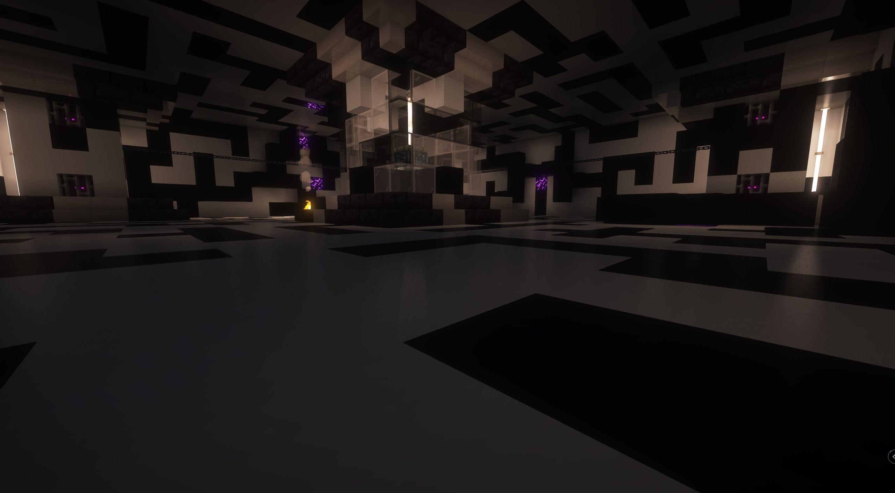
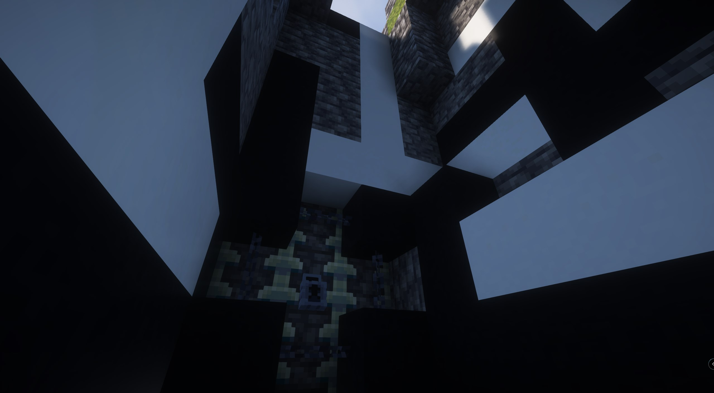

# Runic Island

## <mark style="color:orange;">Gallery</mark>

<div><figure><figcaption></figcaption></figure> <figure><figcaption></figcaption></figure> <figure><figcaption></figcaption></figure></div>

## <mark style="color:orange;">Information</mark>

The Runic Island manifests high in the skies of the normal world, a rare sight to behold. You can pinpoint its location through the Asflors questline or by discovering its associated stele, the Proto-Island.
\
The island's primary entrance is sealed, requiring a specific key obtained in Asflors to unlock.

<details>

<summary>Spoiler : Enter wihout the quest</summary>

Alternatively, for those who seek unconventional paths, rumour has it there are five secret ways to enter the Runic Island without the key. Discovering them is part of the challenge! The only clue offered: sometimes, one door conceals another...

</details>


## <mark style="color:orange;">Runic Dimensions</mark>

Within the Runic Island, you can find the portal leading to the runic dimension. It is situated past the main fight chamber. Search the floor in that area for trapdoors; opening them will reveal the path down to the portal room.

<figure><figcaption></figcaption></figure>

## <mark style="color:orange;">Command</mark>

```css
locate structure yggdrasil:runic_fracture
```
