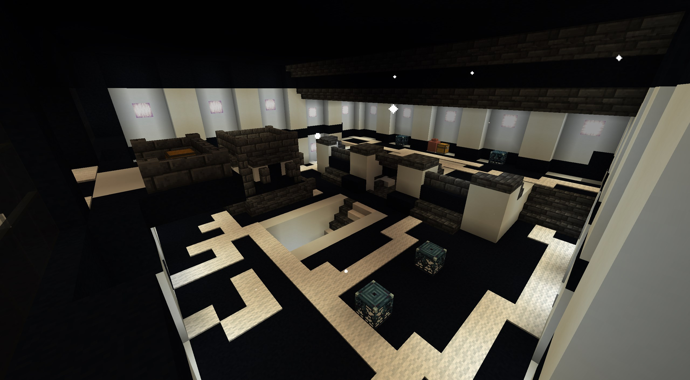
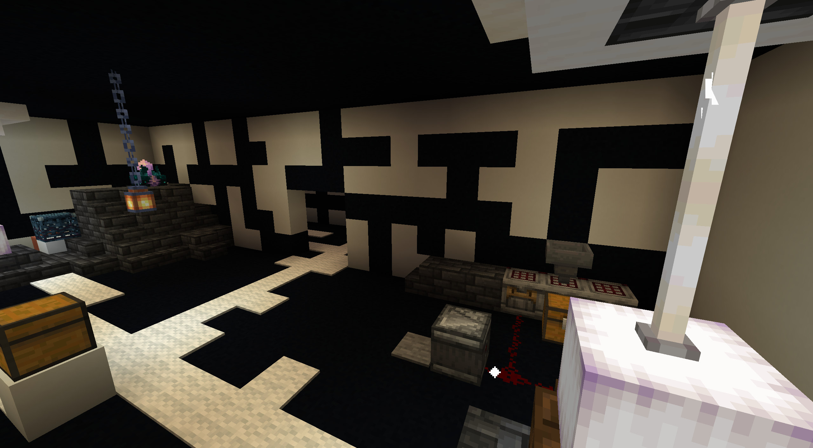
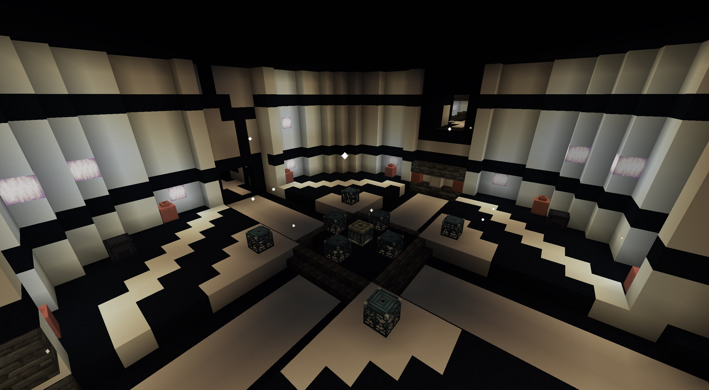
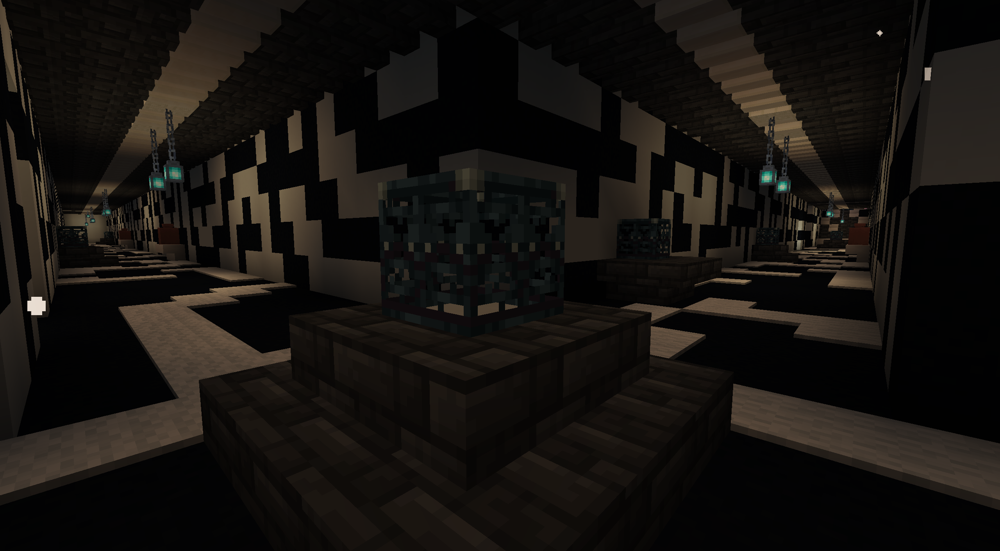

# Runic Labyrinth

## <mark style="color:orange;">Gallery</mark>

<div><figure><figcaption></figcaption></figure> <figure><figcaption></figcaption></figure></div>

<div><figure><figcaption></figcaption></figure> <figure><figcaption></figcaption></figure></div>

***

## <mark style="color:orange;">Information</mark>

Hidden within the runic dimension, the Runic Labyrinth delves deep underground, accessible only via a chasm piercing the surface. Brace yourself, as this ranks among the game's most intricate and challenging structures. Sprawling over a massive 500x500 block area, this colossal maze guarantees hours upon hours of exploration


## <mark style="color:orange;">Legendary Weapons</mark>

<figure><figcaption></figcaption></figure>

#### Dark Elven Bow

You'll find this bow near the entrance pit of the Runic Labyrinth. Break through the floor upon arrival to drop into a cubic chamber. Look up; the bow is suspended from chains attached to the ceiling.

#### Twilight Of Yggdrasil Bow

This bow is locked away within the Ominous Vaults of the structure. To open these vaults, you'll need a key. While keys can potentially be found in various spots, check shulker boxes for a higher chance of finding one.

#### Ran's Apples

Found within special chests located in specific rooms of the Runic Labyrinth.

Upon consumption, the apple instantly teleports the player to the highest reachable block directly above their current coordinates. This makes them an invaluable tool for quickly ascending out of the labyrinth's depths.


## <mark style="color:orange;">Command</mark>

```css
execute in yggdrasil:ginnungagap run tp @s ~ ~ ~
locate structure yggdrasil:runic_labyrinth
```
