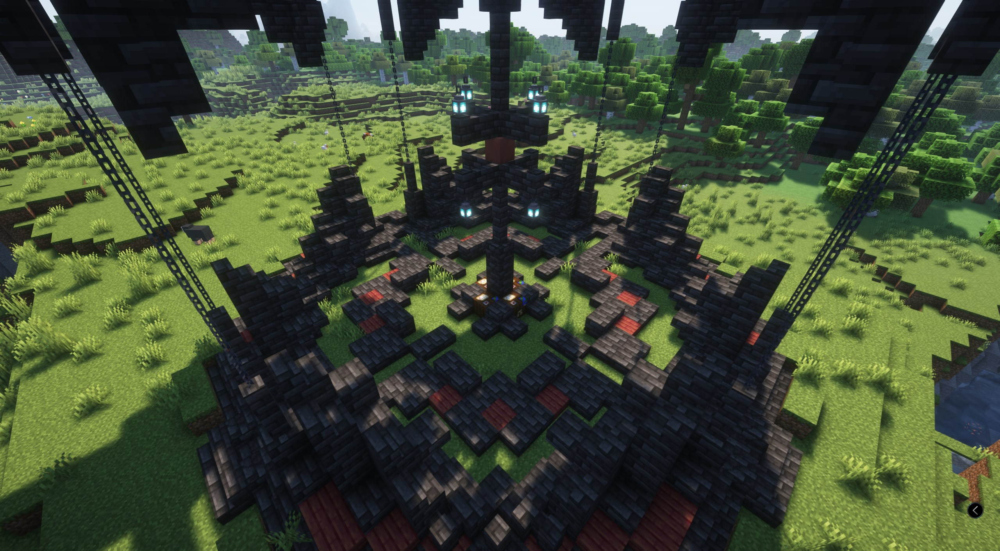
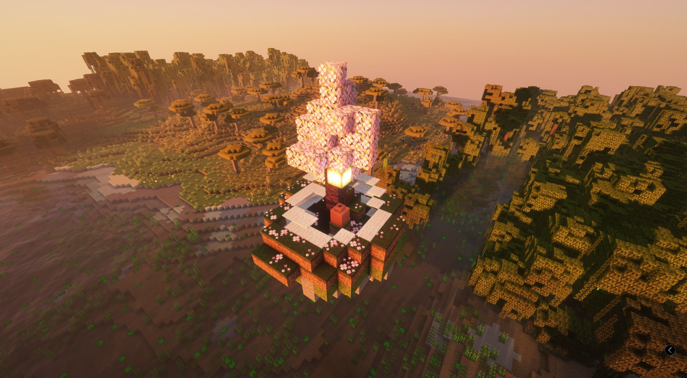
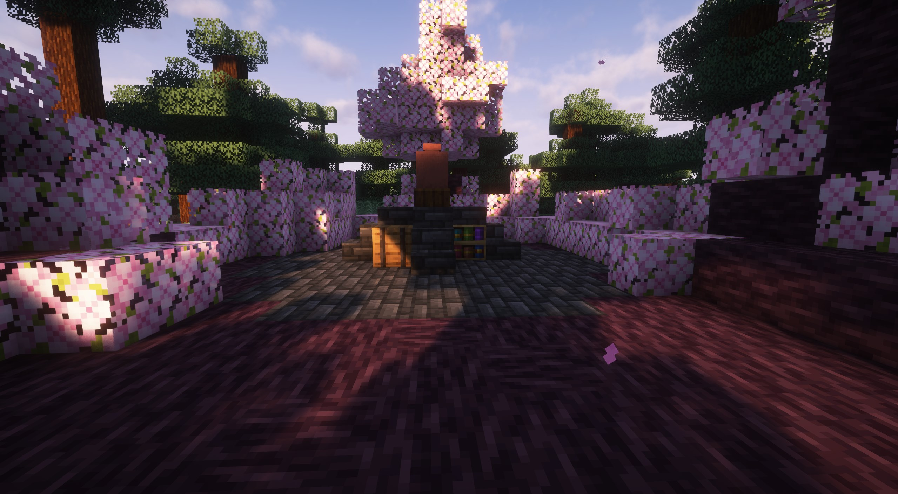
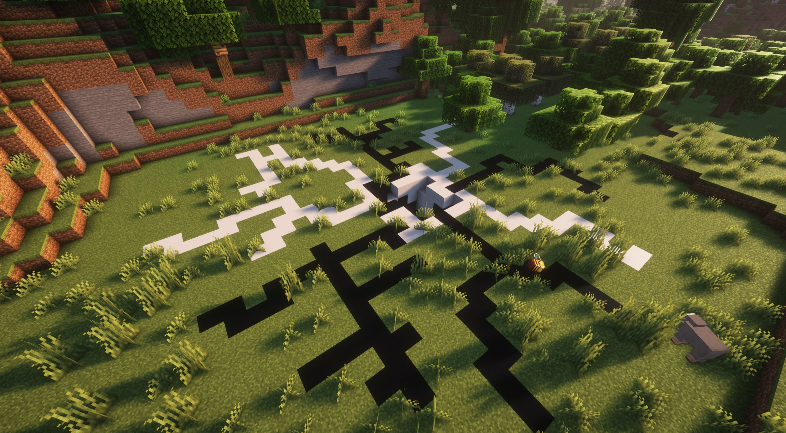
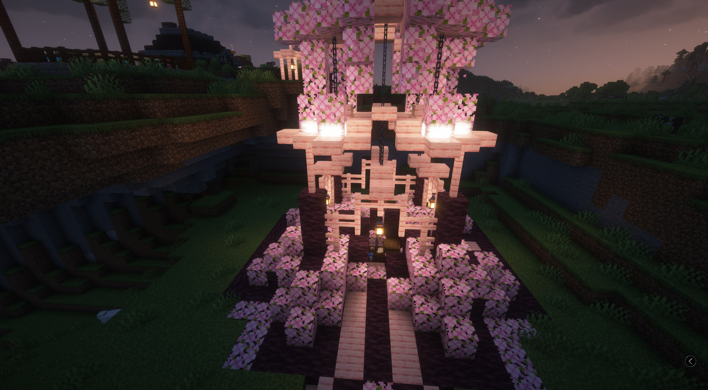
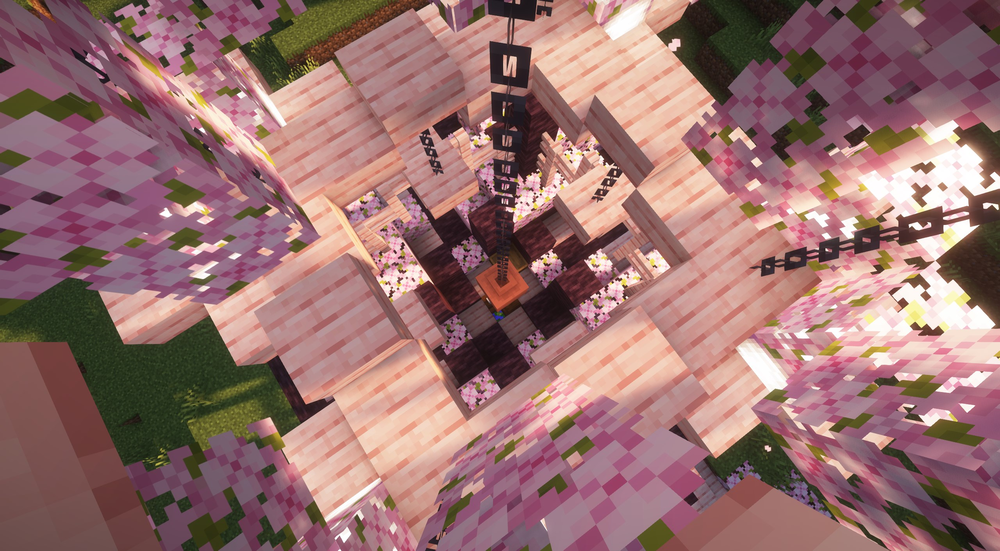
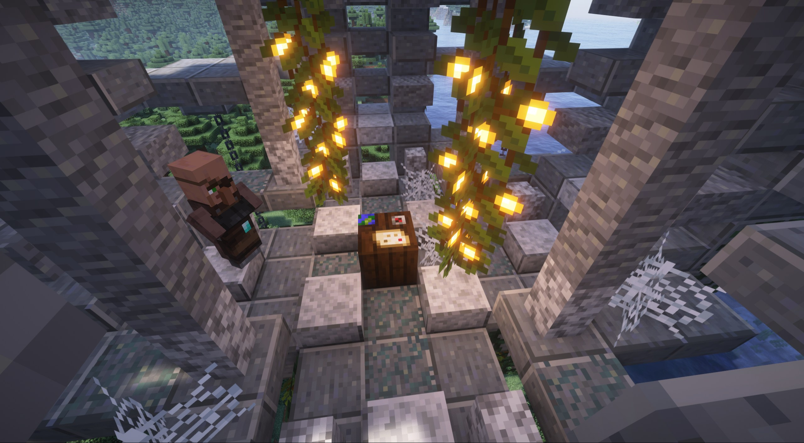
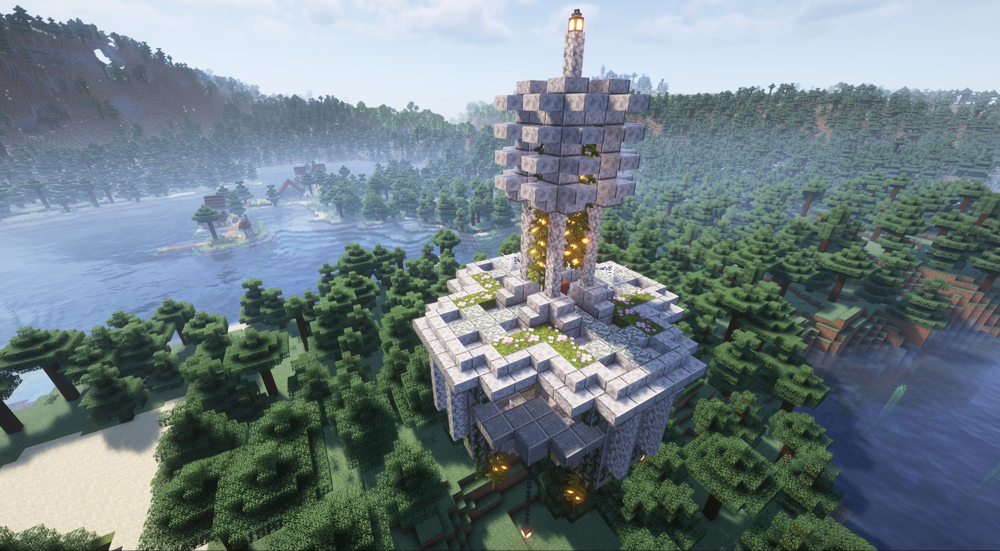

# Steles

### <mark style="color:orange;">Helblom</mark>

Helbloms are mini-structures representing Helheim. They contain decorated pots; breaking them yields a map to Helheim. These structures also house a villager who trades Helheim keys for divine keys.

> Object: Map to Helheim

<figure><figcaption></figcaption></figure>

***

### <mark style="color:orange;">Proto-Island</mark>

Proto-Islands are ancient floating structures linked to the Runic Islands. They contain Runic Monoliths; activating them reveals a Runic Compass pointing towards the Runic Islands. These structures also feature cryptic carvings offering clues

> Object: Map to Runic Island

<figure><figcaption></figcaption></figure>

***

### <mark style="color:orange;">Voroblom</mark>

Vorobloms are desolate, icy structures linked to Glaosheimr. They contain Frozen Orbs; shattering them reveals a Map to Glaosheimr. These structures are sometimes inhabited by lone Frost Giants.

> Object: Map to Glaosheimr

<figure><figcaption></figcaption></figure>

***

### <mark style="color:orange;">Zenflors</mark>

Zenflors are serene, garden-like structures linked to Asflors. They contain Resonating Crystals; attuning to them reveals a Map to Asflors. These structures house meditating spirits offering wisdom.

> Object: Map to Asflors

<figure><figcaption></figcaption></figure> <figure><figcaption></figcaption></figure>

***

### <mark style="color:orange;">Lifblom</mark>

Lifbloms are vibrant floral structures linked to Alfheim. They contain Luminous Pods; harvesting them reveals a Map to Alfheim. These structures often attract Pixies offering rare trades.

> Object: Map to Alfheim

<figure><figcaption></figcaption></figure> <figure><figcaption></figcaption></figure>

***

### <mark style="color:orange;">Neogard</mark>

Neogards are imposing fortress-like structures linked to Asgard. They contain a Chest of Trials; unlocking it reveals a Bifrost Shard, a key component for reaching Asgard. These structures are guarded by spectral warriors.

> Object: Map to Asgard

<figure><figcaption></figcaption></figure> <figure><figcaption></figcaption></figure>

